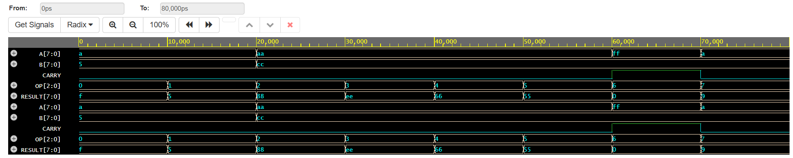
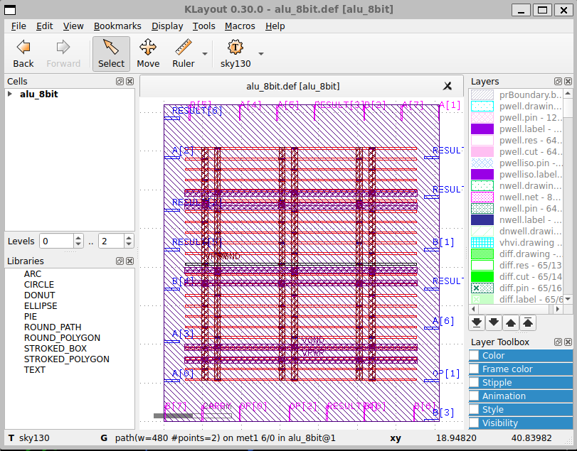

# 8-bit ALU RTL-to-GDSII Physical Design

## Project Overview

This project implements an 8-bit Arithmetic Logic Unit (ALU) from RTL design to final GDSII using an open-source ASIC physical design flow.

The design was synthesized and physically implemented using **OpenLane** with the **SKY130 PDK**.

### Project Objectives

- Design and verify an 8-bit ALU using Verilog HDL
- Perform RTL functional simulation
- Synthesize the RTL into a gate-level netlist
- Perform floorplanning and power planning
- Perform standard-cell placement
- Perform routing
- Perform physical verification using DRC and LVS
- Generate the final GDSII layout

---

## ALU Specification

### Inputs

| Signal | Width | Description |
|---|---:|---|
| A | 8-bit | First operand |
| B | 8-bit | Second operand |
| OP | 3-bit | Operation selection |

### Outputs

| Signal | Width | Description |
|---|---:|---|
| RESULT | 8-bit | ALU operation result |
| CARRY | 1-bit | Carry output |

### Supported Operations

| OP | Operation | Function |
|---|---|---|
| 000 | ADD | A + B |
| 001 | SUB | A - B |
| 010 | AND | A & B |
| 011 | OR | A \| B |
| 100 | XOR | A ^ B |
| 101 | NOT | ~A |
| 110 | INC | A + 1 |
| 111 | DEC | A - 1 |

---

## Tools and Technologies

- **Verilog HDL**
- **Icarus Verilog**
- **GTKWave / EPWave**
- **OpenLane**
- **Yosys**
- **SKY130 PDK**
- **OpenROAD**
- **Magic**
- **Netgen**
- **KLayout**
- **WSL2 + Ubuntu**
- **Docker**

---

## RTL-to-GDSII Flow

text
RTL Design
    ↓
RTL Simulation
    ↓
Logic Synthesis
    ↓
Floorplanning
    ↓
Power Planning / PDN
    ↓
Placement
    ↓
CTS
    ↓
Routing
    ↓
DRC
    ↓
LVS
    ↓
Final GDSII
---

## RTL Simulation

The ALU RTL was functionally verified using a testbench covering all eight operations.

### Simulation Waveform



---

## Physical Design Results

### Floorplan

The design was floorplanned using OpenLane.


### Power Planning / PDN

Power distribution was implemented using the OpenLane PDN flow.


### Placement

Standard cells were placed within the defined core area.



---

## Physical Verification

### DRC

The OpenLane signoff DRC report reported:


DRC violations = 0
### LVS

The LVS verification reported:


Total errors = 0
No net, device, pin, or property mismatches were reported.

---

## Final Design Metrics

| Parameter | Result |
|---|---:|
| Die Area | 0.005844 mm² |
| Core Area | 3578.432 µm² |
| Synthesized Cell Count | 174 |
| Total Cells | 572 |
| Wire Count | 293 |
| Wire Length | 4442 |
| Vias | 1380 |
| Routing Violations | 0 |
| DRC Violations | 0 |
| LVS Errors | 0 |
| Critical Path | 2.64 ns |

---

## CTS Note

CTS was not applicable to this ALU because it is a clockless combinational design with no clock input or sequential elements.

---

## Final GDSII

The final physical design was successfully generated as:


alu_8bit.gds
The final layout was viewed using KLayout.

---

## Project Files

- RTL: `rtl/alu_8bit.v`
- Testbench: `simulation/alu_8bit_tb.v`
- OpenLane Configuration: `openlane/config.tcl`
- Project Report: `8bit_ALU_Complete_Project_Report_Final.pdf`

---

## Conclusion

The 8-bit ALU was successfully implemented through an open-source RTL-to-GDSII physical design flow using OpenLane and the SKY130 PDK.

The flow covered RTL design, simulation, synthesis, floorplanning, power planning, placement, routing, DRC, LVS, and final GDSII generation.

The final signoff results reported:

```text
DRC violations = 0
LVS errors = 0

## Author

**Vijay M**

**Karpagam College of Engineering**
